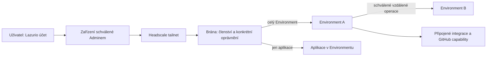

# Účet, zařízení a přístupy k Environmentům

Rozhodnutí Matěje z 2026-10-06, root decision **0192**, včetně následného
rozhodnutí o vědomém sdílení na základě důvěry. [Architektonické review](environment-access-review-2026-10-06.md)
zachovává nálezy a odlišuje původní doporučení od následné volby Operátora.
Samotný dokument nemění nasazené přihlášení, členství, brány ani
síť. Plánování vlastní DEV-6640, síťovou realizaci DEV-6641 a účty
DEV-6551/DEV-6552 v Mission Controlu Human and Machine. Každý consumer musí
před přechodem doložit níže uvedené chování. Dosavadní GitHub/Team brány
zůstávají označenou migrační implementací, nikoli cílem k další expanzi.

## Člověk a pracovní schopnosti

Směrem k lidem používáme **uživatel**. Uživatel má jeden Lazurio účet s
neměnným identifikátorem issuer + subject. GitHub je volitelná propojená
identita a pracovní schopnost; připojení samo nevytváří repo grant, právo
schválit PR ani právo spravovat Organizaci. Technické názvy dosavadních
GitHub rolí mohou zůstat v kompatibilitních kontraktech; nejsou druhy lidí.

Lazurio účet může získat oprávnění k individuálnímu i týmovému pracovnímu
Environmentu bez GitHub účtu. Přihlášení, členství v Organizaci, přidělení
Environmentu a GitHub identita používaná uvnitř jsou odlišné vazby.
Stejný e-mail, login ani zobrazované jméno účty neslučují. Odpojení GitHubu
nepřevádí Environment na jiného člověka a samo nemaže Lazurio účet.

Pracovní Environment vlastní Organizace; člověku ho přiděluje. Osobní
Environment a jeho Personalspace zůstávají soukromou hranicí jednoho člověka.
Plný přístup jiného uživatele k jeho Personalspace se tímto rozhodnutím
nezavádí. Vědomě zpřístupněná aplikace či export nesmí obejít tuto hranici.

## Tři samostatné podmínky vstupu

1. **Síť:** klient používá Tailscale připojený ke správnému Headscale tailnetu
   a konkrétní zařízení schválil Admin. OIDC přihlášení ověří účet, ale samo
   zařízení neschválí. Neschválené, odvolané či nahrazené zařízení nemá
   přístup k chráněným Environmentům ani jejich aplikacím; selhání ověření
   nepovolí dřívější souhlas použít pro jiné zařízení.
2. **Organizace:** uživatel je aktivním členem cílové Organizace v Lazuriu.
   Síťová dosažitelnost ani členství v jiné Organizaci sdílející tailnet
   tuto podmínku nenahrazují.
3. **Cíl:** účet má konkrétní oprávnění k celému Environmentu nebo k určené
   aplikaci. Brána kontroluje rozsah na serverové straně.

Nevzniká veřejná alternativní cesta k pracovnímu Environmentu ani k jeho
aplikacím. Přihlašovací/control-plane endpoint nutný k založení požadavku na
připojení není přístupem k pracovním datům. Síťová schválení se vážou na
konkrétní identitu zařízení a účet; jejich přesný mechanismus musí prokázat
DEV-6641 na skutečném Headscale. Nová registrace nesmí získat provozní přístup
v mezeře před schválením. SSH ze schváleného zařízení do pracovního
Environmentu, který je přidělený témuž člověku, je pravidlo: vzniká v téže
reviewované změně jako schválení zařízení a při změně přidělení, odvolání
zařízení nebo konci členství se v téže změně síťového záměru přidá nebo
odebere. Opačný směr (Environment →
zařízení) se obecně nedává a jde o samostatné rozhodnutí (0182); jiné SSH
vyžaduje vlastní oprávnění.

**Schválení zařízení.** Schválení je vztah konkrétního zařízení, účtu jeho
vlastníka a cílové Organizace. Na tailnetu, který obsluhuje víc Organizací,
schvaluje vstup do každé Organizace její Admin; schválení pro jednu Organizaci
neotevře jinou a jedno zařízení může nést schválení pro víc Organizací. Do
přechodu na Auth drží schválení jediný zapisovatel: síťový záměr v Deployment
Repu vlastníka hostu. Vznikne reviewovanou změnou ze živého stavu a vynutí ho
Machines (Plan, Permit, readback); Dashboard ho nepřepisuje přímým zápisem do
Headscale. Přesun záznamu do Auth je samostatná migrace bez období dvou
zapisovatelů.

## Kdo může přístup spravovat

Admin schvaluje členství v Organizaci a přijetí zařízení do její sítě,
přiděluje pracovní Environmenty a spravuje oprávnění napříč uživateli.
Jeho role musí být ověřená; nápis Admin ani přítomnost v tailnetu ji nedává.
Stávající pravidla pro GitHub Owner důkaz při správě zdrojů, releasů a
infrastruktury se tím neruší.

**Členství u účtů s GitHubem.** Členství v Lazurio Organizaci eviduje Auth.
U účtu s propojeným GitHubem ho dál promítá živé členství v GitHub
Organizaci; rozhodnutí z 2026-10-04 platí a Matěj ho 2026-10-06 potvrdil.
Člena bez GitHubu přidá Admin v Dashboardu, až Auth nabídne druhou
přihlašovací metodu (DEV-6551). Nejde o druhý seznam: pro tyto účty je
GitHub vstupem jedné evidence.

Vstup lidí do týmového Environmentu spravuje Admin. Do přechodu na granty
Authu ho určuje členství v GitHub Teamu Environmentu jako označená migrační
implementace.

Přidělený uživatel smí v rámci svého oprávnění:

- zpřístupnit svůj pracovní Environment jinému **již aktivnímu členovi téže
  Organizace**, buď celý, nebo jen vybrané aplikace; Environment s daty více
  Organizací celý jen členovi každé z nich (viz níže);
- odvolat takto udělený přístup;
- povolit orientované propojení dvou Environmentů přidělených jemu v téže
  Organizaci, včetně deklarovaného účtu a rozsahu vzdálených operací.

Každé takové sdílení nepotřebuje nové ruční schválení Adminem. Uživatel ale
nemůže pozvat externího člověka, vytvořit členství, schválit zařízení,
přidělit si cizí Environment nebo obejít organizační hranici. Admin může
propojit Environmenty napříč uživateli v Organizaci. Přidělení dvou
Environmentů z různých Organizací samo nepovoluje propojení jejich dat.
Přeshraniční servisní granty vyžadují vlastní výslovnou autoritu a zachovávají
svůj omezený rozsah; tento model je automaticky nerozšiřuje.

Delegované sdílení celého Environmentu i jednotlivé aplikace se váže na
konkrétní původní přidělení a cílový prostředek. Ztráta nebo změna přidělení,
odebrání členství sdílejícího či příjemce a zrušení nebo převázání cíle tato
sdílení zneplatní; nový přidělený uživatel je nepřebírá a pozdější obnovení
členství je samo neoživí. Nezávislý platný grant zůstává samostatnou cestou
přístupu a Dashboard jej musí ukázat. Přidělení novému člověku proto nemůže
zpřístupnit jeho nová přihlášení lidem, kterým důvěřoval předchozí uživatel.

## Celý Environment, aplikace a vzdálené operace

| Oprávnění | Důsledek |
|---|---|
| Celý Environment | Launchpad, Chat, Automatizace, pracovní soubory a schopnosti dostupné uvnitř. Nejde o izolovaný účet uvnitř sdíleného runtime. |
| Vybraná aplikace | Pouze konkrétní aplikace a její vlastní role. Žádný shell, Chat, Automatizace, jiné aplikace ani přebírání přihlašovacích údajů Environmentu. |
| Environment A → Environment B | Přesně vymezené vzdálené operace; u SSH také cílový OS účet, přihlašovací mechanismus a rozsah. Povolený port sám nestačí. |
| Environment → integrace | Schopnosti připojeného účtu nebo brokeru. Osobní přihlášení návštěvníka se automaticky nevkládá do sdíleného Environmentu. |

Oprávnění k aplikaci musí držet skutečná brána včetně API, WebSocketů,
downloadů a přímých URL; skrytí navigace nestačí. Role uvnitř aplikace a její
datová oprávnění patří aplikaci. Delegované sdílení aplikace dává nejvýše
základní vstup `user`; nepřiděluje `admin` ani oprávnění spravovat další
granty. Přímé základní granty spravuje Admin, aplikační role její vlastní
autorita. Plný přístup k Environmentu není oprávněním
automaticky měnit seznam jeho uživatelů nebo členství Organizace.

Aplikační přístup nikdy nezahrnuje prohlížeč ani plochu Environmentu
(`browser.`, `desktop.`) ani jinou cestu, která ovládá celý Environment.
Sdílená cookie brány z 0191 (8b) není aplikační grant; brána ověřuje každý
cíl zvlášť. Bod 10 rozhodnutí 0191 (vymazat profil prohlížeče před
přeřazením pracovního Environmentu jinému člověku) platí dál; 0192 ruší jen
povinné odhlašování při běžném sdílení.

### Plné sdílení individuálního pracovního Environmentu je vědomá důvěra

Přidělený uživatel může důvěryhodnému člověku udělit plný přístup i tehdy,
když v Environmentu zůstávají jeho osobní pracovní přihlášení. Přijímá
riziko, že příjemce může použít **všechno dostupné uvnitř**: soubory,
procesy, Chat, automatizace, browser a jeho relace, hesla a passkeys,
GitHub i jiné integrace a existující vzdálené přístupy. Systém před
sdílením nevynucuje odhlášení, výmaz profilu, výměnu účtů za broker,
převod na týmový režim ani další schválení Adminem.

Tato volba je pro pomoc člověka, kterému sdílející důvěřuje. Pro spolupráci
bez takové osobní důvěry slouží samostatný týmový Environment. V obou
případech zůstává povinné členství v Organizaci a konkrétní zařízení
schválené Adminem; kamarád nebo příbuzný není výjimkou. Pracovní sdílení
se netýká soukromého Personalspace a nezakládá do něj oprávnění ani nová
propojení. Ručně uložené vzdálené credentials však mohou jeho data technicky
vystavit; zákaz číst cizí Personalspace tím nezaniká a model neslibuje
izolaci libovolných přihlášení uložených uvnitř plně sdíleného runtime.

**Environment s daty více Organizací.** Obsahuje-li individuální pracovní
Environment repozitáře, data nebo přihlášení více Organizací, smí ho
přidělený uživatel plně sdílet jen s člověkem, který je aktivním členem každé
z nich (rozhodnutí Matěje z 2026-10-06). Organizace připojené do Environmentu
sdílení zkontroluje; že osobní přihlášení, například GitHub, může sahat i do
dalších Organizací, vysvětlí text u sdílení a odpovídá za to sdílející. Jinak
zbývá sdílení vybraných aplikací nebo týmový Environment.
Cílově má GitHub přihlášení v pracovním Environmentu sahat jen do
Organizací tohoto Environmentu, přes OAuth přihlášení bez osobních tokenů
(PAT); mechanismus se teprve ověří, do té doby platí vysvětlení výše.

Dashboard a onboarding vysvětlí rozsah přímo u volby plného přístupu,
bez dalšího schvalovacího workflow. Návrh textu:

> Dáváš tomuto člověku plný přístup ke všemu v tomto Environmentu, včetně
> souborů, přihlášených účtů a přístupů do dalších služeb a Environmentů.
> Uděl ho jen člověku, kterému důvěřuješ; riziko neseš ty. Pokud jsou tu data
> nebo přihlášení i jiných Organizací, dostane se k nim také, proto ho uděl jen
> členovi všech těchto Organizací. Přístup můžeš odebrat, ale již získaná data
> nebo zkopírované přihlašovací údaje tím nezmizí.

Akce „Udělit plný přístup“ je vědomé udělení tohoto rozsahu. „Pouze vybrané
aplikace“ zůstává samostatná skutečně omezená možnost. Žádná nová persona,
bezpečnostní certifikace příjemce nebo povinný režim sdílených credentials
se nezavádí.

Plný vstup nepřidá příjemcovu Lazurio účtu Admin roli. Uložená relace
Admina či jiná privilegovaná identita ale může stejné operace technicky
umožnit; mezi plnými operátory tohoto runtime systém izolaci neslibuje.
Odpovědnost za použití sdílených identit a konkrétní publikační pokyny drží
proces a jmenovaní lidé. Udělení vstupu samo není pokyn provést konkrétní
merge, vydání nebo nasazení. Audit odlišuje doložený vstup člověka od
operace pod účtem dostupným uvnitř; neslibuje jejich nezaměnitelnou shodu.

Odebrání sdílení zavře další vstup a ukončí podporované aktivní relace
podle změřeného kontraktu. Není to vzdálený výmaz kopií ani automatická
revokace všech externích účtů. Při ztrátě důvěry je revokace či rotace
dotčených klíčů a kontrola přetrvávajících změn samostatný recovery krok;
preventivní odhlašování není podmínkou běžného sdílení.

Agent je běh uvnitř Environmentu, nikoli další uživatelská role. Používá
schopnosti tohoto Environmentu. SSH nepředstavuje výhradně agenty a HTTPS
výhradně lidi: obojí mohou používat lidé i automatizace.

Pokud mají další lidé plný přístup do A a A může přes SSH ovládat B, získávají
tím nepřímý přístup k B. Dashboard musí při propojení i sdílení ukázat tento
dopad a ověřit oprávnění ke změně příslušného grantu nebo propojení.
Vědomé plné sdílení A zahrnuje jeho již dostupné vzdálené schopnosti;
nevyžaduje nový přímý uživatelský grant do B jen proto, že je B dostupné
zevnitř A. Nevytváří tím novou síťovou hranu, členství, přímý vstup do B
ani cross-organization grant v Auth. Přihlášená integrace však může mít
širší dosah a ten patří k přijatému riziku; nelze slibovat, že ho izoluje
vstupní ACL. Mapa rozliší přímé oprávnění a efektivní cestu přes A.
Audit rozliší doloženého člověka, zdrojový Environment, cíl a použitou
pracovní identitu; samotná sdílená identita neprokazuje konkrétního člověka.

## GitHub a publikace

GitHub Team vymezuje repozitářové schopnosti týmového Environmentu, není
povinnou vstupenkou každého jeho uživatele. Lazurio for GitHub je instalace
Organizace; broker omezuje její operace na příslušný Team a repozitáře.

Uživatel bez GitHubu smí přes týmový Environment připravit změnu, vytvořit PR
jeho identitou a použít preview v povoleném rozsahu. GitHub účet není potřeba
k tomu, aby byl autor požadavku auditovatelný jako Lazurio subject.
Schválení a Publikaci provádí jmenovaný člověk s živým GitHub oprávněním.
Broker, přihlašovací údaje a ochrana větví musí prokazatelně zabránit tomu,
aby sdílený Environment sám provedl merge nebo přímý zápis do chráněné
větve. Bez tohoto důkazu se přístup nové skupině uživatelů nerozšíří.

Tento kontrakt týmové GitHub capability není slib izolace osobní identity
uvnitř vědomě sdíleného individuálního pracovního Environmentu. Tam je
možnost použít uloženou publikační identitu výslovně přijaté riziko a
odpovědnost drží proces. Také v týmovém browseru platí, že dodatečně
vložené osobní přihlášení je dostupné všem plným operátorům; ochrany
organizačního bota samy neomezují práva takto vloženého účtu.

## Autority a mapa Conglomerate

| Pravda | Vlastník |
|---|---|
| Lazurio účty, propojené identity, členství a oprávnění ke vstupu | Auth na standardním identity provideru; Dashboard je spravuje, nevytváří druhý seznam ACL. |
| Technická existence, vlastník a nasazené verze Environmentu; konfigurace a důkazy sítě | Deployment Repo vlastníka a řízený apply Machines. |
| Schválení zařízení pro Organizaci | Do přechodu na Auth síťový záměr v Deployment Repu vlastníka hostu jako jediný zapisovatel, vynucený řízeným apply Machines; cílově Auth spravovaný z Dashboardu. |
| Přidělení uživatele a delegované sdílení | Jeden autoritativní account/access kontrakt Auth spravovaný přes Dashboard. Dosavadní infra assignment je migrační vstup, ne druhý nezávislý writer. |
| Repozitáře, Team capability, schválení PR a branch rules | GitHub. |
| Tajné hodnoty | Příslušný trezor/custody; ostatní vrstvy drží reference. |
| Zobrazení vztahů a stavu | Dashboard, odvozeně z oprávnění, deklarací, evidence apply a čerstvého hlášení hostu. |

Mapa má vrstvy **Uživatelé → Zařízení → Environmenty → Připojené aplikace**,
seskupené po Organizacích. Rozlišuje plný a aplikační přístup, směrové
Environment-to-Environment operace, přidělení a vlastnictví. Ukazuje také
čekající schválení, požadovaný, nasazený, živý a odvolávaný stav. Není novou
autoritou. Uživatel bez GitHubu smí vidět své autorizované prostředky bez
práva číst celý infra repozitář; backend poskytne jen příslušnou projekci.
Celou mapu Organizace vidí její Admin (dnes ověřený živý GitHub Owner);
uživatel vidí svá zařízení a prostředky, ke kterým má přístup (rozhodnutí
Matěje z 2026-10-06 večer v DEV-6640).

Síťová pravidla jsou odvozený nasazený výstup schválené politiky a konkrétního
zařízení. Změny infrastruktury dál používají řízené plánování, apply a
evidenci; Dashboard nesmí obejít tyto kontroly přímým zápisem do Headscale.
To neznamená nutnost osobního GitHub účtu nebo dalšího kliknutí Admina pro
každé dovolené interní sdílení. Servisní vykonavatel smí mít jen rozsah
schválené operace a nesmí vytvářet vlastní přístupovou autoritu.

## Přechod a ověření

Rozhodnutí nahrazuje v cílovém modelu 0184 a DEV-6641 vazbu identity na
GitHub ID, automatické schválení zařízení a O10 jako dostatečnou vstupní
politiku. Nahrazuje také výklad 0183/DEV-6640, že každé uživatelské sdílení
musí být ruční PR a viditelnost mapy vyžaduje osobní read grant do infra.
GitHub ID se zachová jako ověřený link a migrační důkaz. Existující DNS
slugs, adresy, klíče ani servisní granty se bez přesného plánu nepřepisují.
Existujícímu přístupu bez doložené vazby na přidělení se při migraci nevymyslí
původ delegovaného sdílení. Zachová se jeho skutečný správcovský/servisní
původ, přesný rozsah a ověřená autorita; nejasné případy vyřeší migrační plán.

Před realizací své části musí owning repa prokázat to, co jim z tohoto
seznamu přísluší: uživatele bez GitHubu; nové a odvolané zařízení; plný
versus aplikační přístup; zákaz externího pozvání; sdílení uvnitř Organizace
bez dalšího Admin kroku; propojení vlastních a cizích Environmentů včetně
nepřímého přístupu; PR/preview bez publikace; bezpečné přepřidělení včetně
starých relací a credentials; odmítnutí při výpadku autority a odvolání
členství/přístupu. Odvolání musí mít změřené chování i pro existující
browser, WebSocket a SSH relace. Žádný konkrétní čas ani okamžitá revokace
nejsou tímto textem vydávanou zárukou.

DEV-6640 drží společný kontrakt a mapu; DEV-6551 Auth autoritu,
DEV-6552 přihlášení Dashboardu, DEV-6638 registraci a přidělení,
DEV-6639 seznam a shell, DEV-6644 onboarding a DEV-6645 ovládání Dashboardu.
Dřívější úspěšné testy GitHub-only admission dokazují pouze starý kontrakt.
Tato dokumentační změna nespouští rollout ani nezve žádného uživatele do
skutečné sítě.

DEV-6641 dodává síťovou část ve všech tailnetech, nejdřív ve sdíleném
tailnetu, který obsluhuje víc Organizací. Člověk zařízení zaregistruje
přihlášením do tailnetu Lazurio účtem (Headscale OIDC); zařízení přistane pod
jeho osobním Headscale userem s identitou Lazurio subject a nemá žádný dosah.
Admin každé Organizace schválí konkrétní zařízení. Schválené zařízení dostane
HTTPS a privátní DNS k Environmentům svých schválených Organizací a o vstupu
dál rozhoduje brána Environmentu. SSH zůstává u přesných grantů: zařízení →
Environment přidělený témuž člověku vzniká spolu se schválením zařízení a sleduje
změny přidělení a členství (dodatek 0192 z 2026-10-07), ostatní jen výslovně, a
stávající zařízení se převedou bez nového přihlášení. Vstupní granty brány
(přidělení, plné a aplikační sdílení, vstup bez GitHubu) patří do
DEV-6551/6552/6638/6645; do jejich nasazení brány pouští podle GitHub Teamu
jako označená migrační implementace. Matěj 2026-10-06 večer rozhodl, že se
lidé připojí rovnou touto cílovou cestou, bez dočasné registrace přes
předávaný odkaz.
